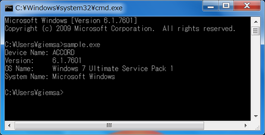
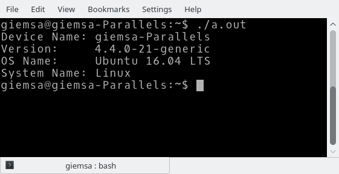
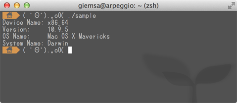

# Property Utilties

 Property Utilities(XPU) is a cross-platform property utilities for C++. XPU get system property such as Operating System name, version. Following platforms are supported:

 - Windows (supported only Windows NT)
 - Mac OS X
 - Linux
 - iOS
 - Android

# How to use
 Add `DeviceInfo.h` and `DeviceInfo.cpp` to your project, depending on each platform.

```
const xpu::DeviceInfo &deviceInfo = xpu::DeviceInfo::getDeviceInfo();

// get operating system name
std::cout << deviceInfo.getOSName() << std::endl;
```

 `xpu::DeviceInfo` is a singleton class. You can call following functions:

### getDeviceName
 Get device name. If you call this function on mobile device or Mac, you can get Hardware model. Otherwise, you can get computer name such as hostname on PC or Linux.

### getOSName
 Get operating system name. You can get full operating system name with version name. On Linux, this function returns Linux distrubition name. This function call `uname` and return the value, if failing to get distribution name.

### getSystemName
 Get system name by using `uname` system call on Linux, or `ver` command on Windows.

### getVersionName
 Get operating system version. This function returns Linux kernel version on Linux (not returns distribution version name).
 
If you use Property Utilities on Mac OS X, add `CoreServices.framework` to your Xcode project.

# Screenshots

### Windows 7
  

### Kubuntu 16.04 LTS
  

### Mac OS X Mavericks
  


# License
Property Utilities is distributed under the Boost Software License. See LICENSE.txt

---
Copylight (c) 2016 Giemsa/MithrilWorks All Rights Reserved.